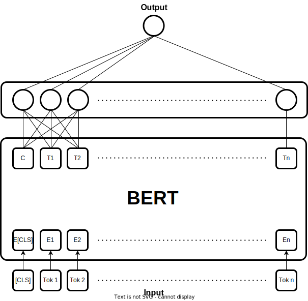
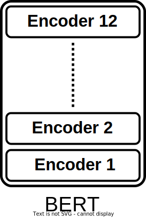
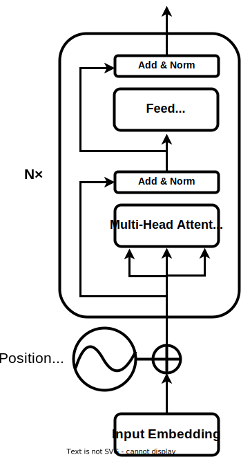

# NLP Disaster Tweets 

A solution to the tweets classification problem is proposed by the use of the pre-trained BERT model.

BERT model is used because it performs better than other recurrent network architectures (RNN/GRU/LSTM).

We can find detailed information about the BERT model in these references [Dissecting BERT Part 1: The Encoder](https://medium.com/dissecting-bert/dissecting-bert-part-1-d3c3d495cdb3), [Dissecting BERT Part 2: BERT Specifics](https://medium.com/dissecting-bert/dissecting-bert-part2-335ff2ed9c73). 

The results in the file [submission.csv](./submission.csv) are found by the model summarized in the following diagram:

BERT model (bert-base-cased) consist of twelve Encoders:

Each encoder has the same constitution as encoders in a transformer following the celebrated reference [Antention is all you need](https://arxiv.org/pdf/1706.03762.pdf):

